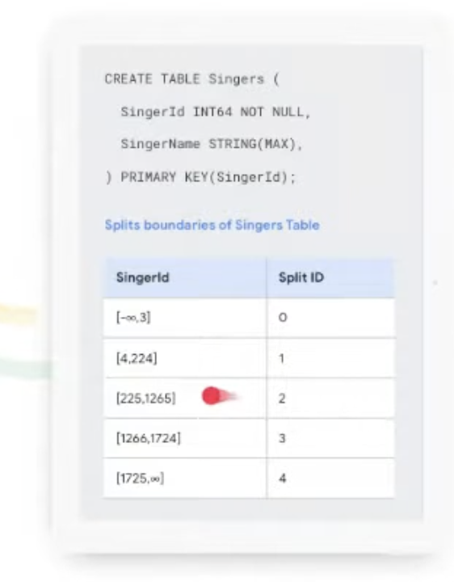
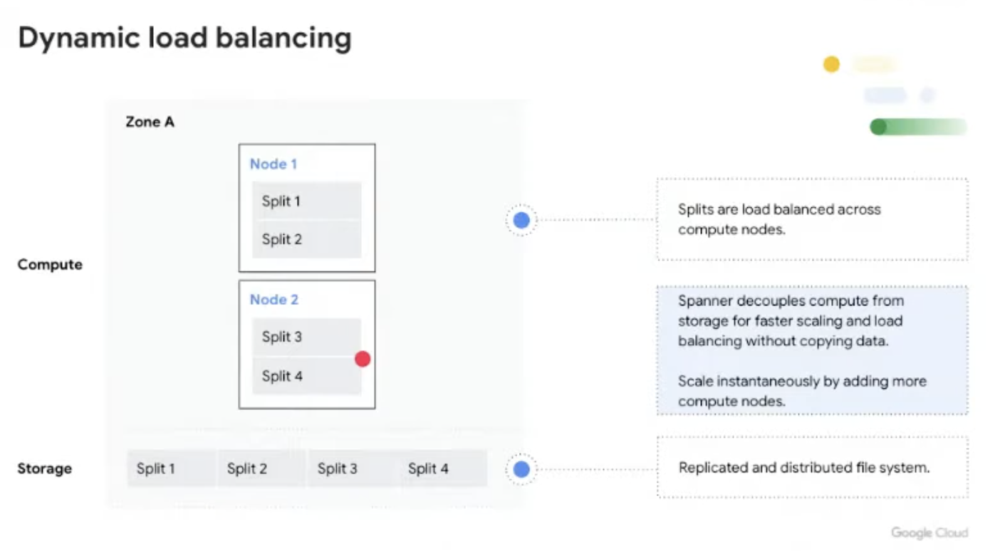
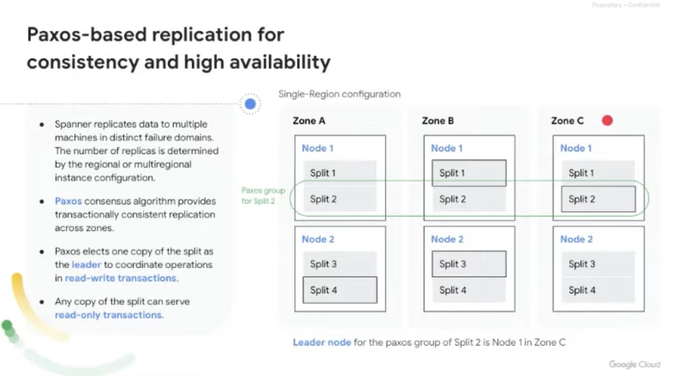
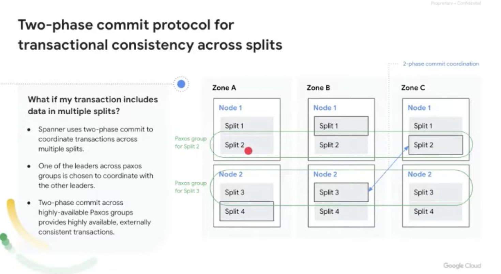
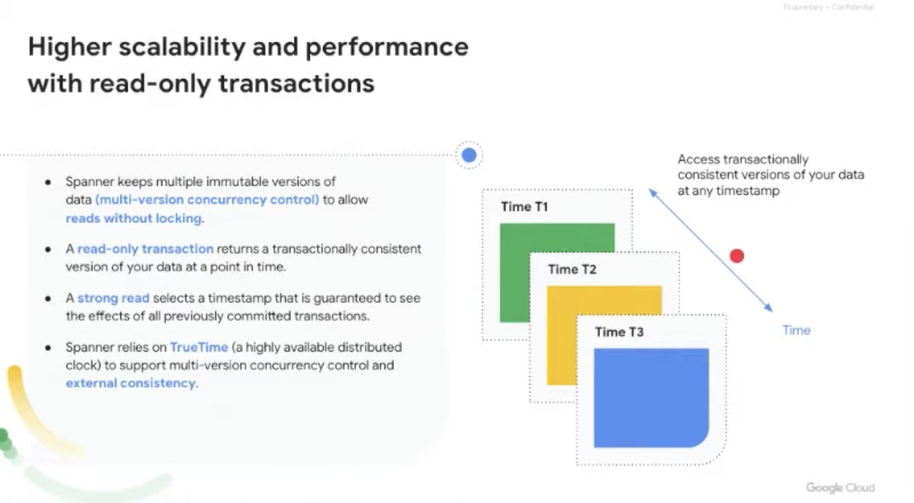
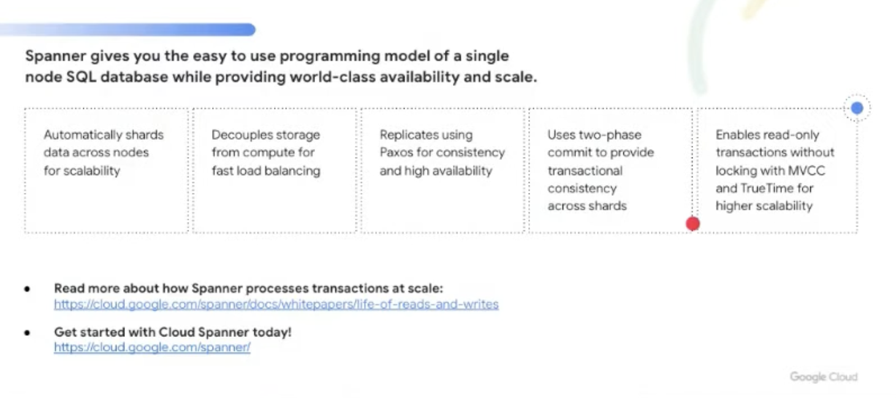
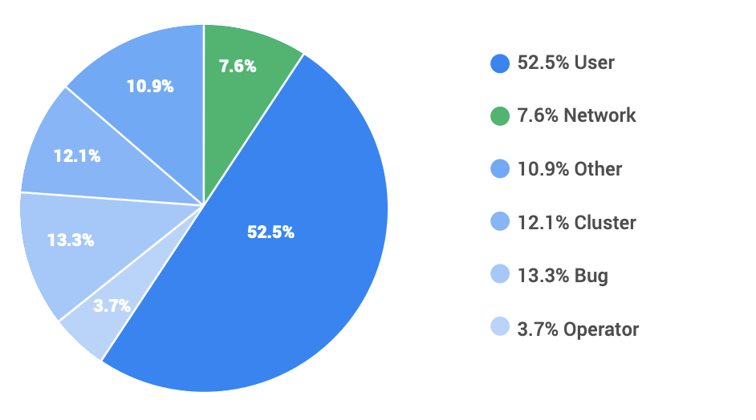

# Learning Google Spanner

- Traditional relational db don't provide easy horizontal scaling or high availability
- Spanner automatically shards data into `splits` corresponding to `key ranges`

- Spanner dynamically repartitions splits based on data size and request load
- Storage is decoupled from compute
    - Data is stored on a distributed file system called `Colossus`
- Compute nodes are assigned splits to serve based on load
    - If split 1 experienced a sudden spike in load, it can move split 2 to another node, so there is more compute to serve split 1
    - If overall load is high, can add new compute nodes

- Spanner replicates database to multiple availability zones 
- Spanner uses `Paxos` algorithm to provide transactionally consistent replication across zones
- Note on the below example for `Paxos group for Split 2`
    - When transition updates data in split 2, the nodes containing split 2 will coordinate the commit together to agree on the commit status and commit timestamp
- `Leader node` for paxos group of Split 2 is Node 1 in Zone C
    - That node is in charge of the coordiation as well as locking all relevant data
    - All operations and read-write transactions are served by leader node of corresponding paxos group
    - Read only transactions can be served by any replica in any of the zones

- Spanner uses a 2 phase commit in the case that a transaction touches multiple splits
- 1 leader across paxos groups is made the coordinator among the other leaders
    - Example below is updating data in splits 2 and 3

- Higher scalability and performance with read-only transactions
- `Multi-version concurrency control`
    - Spanner maintains multiple immutable versions of the db at any commit timestamp within retention period (configurable up to 7 days)
- In example below, we can an *"externally consistent verison of the database"* at t1 time in the past, or we can do a `strong read` to read data at t3

## Spanner, TrueTime, & The CAP Theorem

- https://static.googleusercontent.com/media/research.google.com/en//pubs/archive/45855.pdf

- CAP Theorem recap:
    - Can have 2 of 3 desirable properties
        - C: Consistency
        - A: 100% Availability
        - P: Tolerance to network partition
- 3 kinds of systems: CA, CP, and AP
- Generally viewed that partitions are inevitable so you must either forfeit consistency or availability 
    - Two important caveats:
        - *Only need to forfeit something during an actual partition*
            - There are many mitigations (there is a link to other content here)
        - *Theorem is about 100% availability, discussion is really around realistic high availability*

### Spanner claims to be consistent and available

- Spanner claims to be consistent and highly available
    - Technically, Spanner is NOT a CP system, but in effect it is and users assume CP
    - When a partition does happen, Spanner chooses C and forfeits A
- Because Spanner always provides consistency, can users assume availability?
    - They do, which is why Spanner is "effectively" a CP system
- There are many sources of outages other than just partitions some of which take out the users in addition to Spanner
    - What we really care about are the situations where user can make requests but Spanner is down
    - Outage are due to other things besides partitions

### Availability Data

- Only 7.6% of incidents are because of the network
    - Note that all incidents do not cause outages
    - This section contains partitions and networking configuration issues

### What happens during a Partition

- Spanner uses 2PC and strict two-phase locking to ensure isolation and strong consistency
- Spanner does this by having a member be a Paxos group, so it can continue even if some members within a particular Paxos group are down 
- Spanner chooses C over A when a parition occurs, this is due to a few specific choices
    - Use of Paxos groups to achieve consensus on an update
        - If the leader cannot maintain a quorum due to a parition, updates are stalled and the system is not available (by CAP definition)
    - Use of 2PC for cross-group transactions also means that a parition of the members can prevent commits
- Most likely outcome of a partition in practice is that one side has a quorum and will continue on
    - Services continues to be available but users on minority side have no access
        - In this case, generally the users are likely to have other significant problems as well and can't
    - In this case transactions can continue on the majority side
- Transactions in Spanner work as long as all of the touched groups have a quorum-elected leader and are on one side of the partition
    - This means that some transactions will work perfectly and some will time out, but they are always consistent
- For reads, Spanner uses `TrueTime` in order to manage read consistency
    - Spanner allows clients to specify the desired staleness of their data
        - Strong reads
        - Stale reads
    - When you read from a replica not in the majority, several things can happen depending on type of read and system state
        - Strong read
            - Delayed or blocked read
            - Redirect to leader or update to date repliace or error
        - Stale Reads
            - Successful read
            - Potential staleness
## CAP Twelve Years Later: How the "Rules" Have Changes

- https://www.infoq.com/articles/cap-twelve-years-later-how-the-rules-have-changed/

 

- CAP only prohibits a tiny part of the design space: perfect availability and consistency in the presence of partitions which are rare
- Imagine you have 2 nodes on the opposite sides of a partition
    - Allowing at least one node to update state will cause the nodes to be inconsistent, thus forfeiting C
    - If choise is to perserve consistency, one side of partition must act as if its unavailable, thus forfeiting A
    - Only when nodes communicate is it possible to preserve both consistency and availability, thus forfeiting P
- No need to forfeit C or A when system is not partitioned
- All 3 properties are more continuous than binary
    - For example, availability is continuous from 0% to 100% 
    - There are many different levels of consistency 
- Even with paritions, there can be a disagreement in the system about whether a partition exists

### Acid, Base, and CAP

- In ACID, the `C` means that a transaction pre-serves all database rules - transactions transform database from one valid state to another, adhering to all defined rules and constrains
    - In CAP, the `C` refers to a single copy consistency (a subset of ACID consistency)
        - Every read receives the most recent write or an error
        - All nodes in a distributed system see the same data at the same time
    - ACID consistency cannot be maintained across partitions 